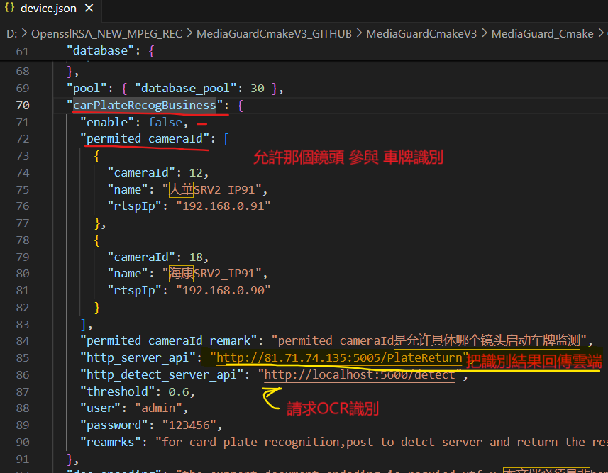
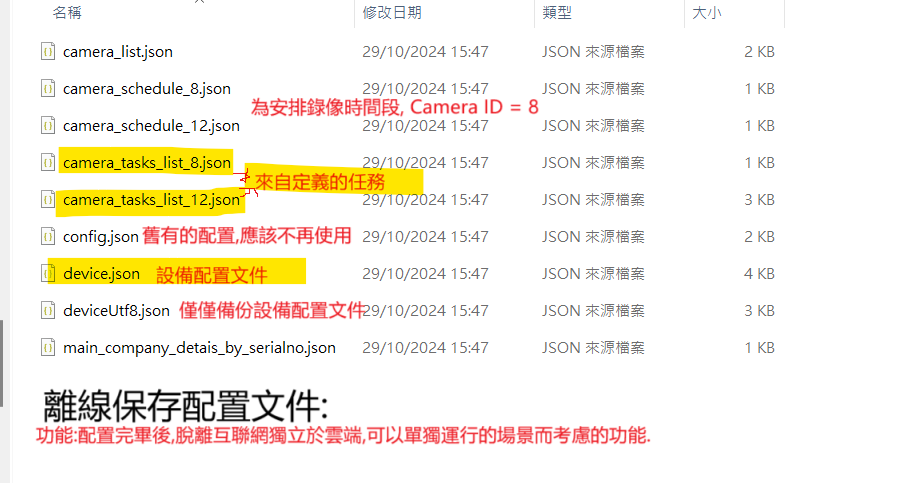

# MediaGuard 功能與開發

## CMakeProject

​	備份在 https://www.123pan.com/

##### 	cmake ../ -G "Visual Studio 17 2022"

##### 	cmake ../ -G "Unix Makefiles"

## 組件

​	MEDIA GUARD 項目主要 組件 : FFMPEG ;4.0  OPENCV 4.9

​	安裝 函數庫 用於 ctrl+break 等事件

​	ncurses 函式庫 $ sudo apt-get install libncurses5-dev

​	ncurses 函式庫是一個用於在終端窗口中創建文字用戶界面（TUI）的函式庫。它提供了一組函式和工具，用於管理終端的顯示，包	括在屏幕上繪製文字、處理用戶輸入以及控制光標位置等。這使得開發人員能夠創建具有較高互動性的終端應用程序，例如文本編輯	器、圖形化菜單和遊戲等。ncurses 函式庫通常用於 Unix-like 系統上，如 Linux 和 macOS。

 

​	**注意: MediaGuard_Cmake.RAR 不包含 3rdlib 子文件夾,由於太冗餘和龐大的文件數量,**

​	**需要從 3rdlib.rar下載下來後 複製到根目錄下  3rdlib  : https://www.123pan.com/s/kDKPjv-Ed3l3.html 提取码:8uT1**

## 頭文件

​	重要文件: Common.h  連接相關多個頭文件

​	參考如何Linux ffmpeg

​	https://blog.csdn.net/mao_hui_fei/article/details/132192108

## openssl 

​	**openssl-1.1.1q出現問題導致** 

##### 	先屏蔽了 std::string md5_lower_string = md5_stringstream.str();  // Cmd5::get_md5(md5_stringstream.str());  

##### 	//引用	openssl1.1.1q

​	`/usr/bin/ld: /home/tonylaw/Desktop/MediaGuard_Cmake/3rdlib/linux/x64/openssl-1.1.1q/libcrypto.so.1.1:`

​	 error adding symbols: DSO missing from command line

​	**https://blog.csdn.net/q7w8e9r4/article/details/134631522**
​	<u>`error adding symbols: DSO missing from command line`</u>

​	上述參考: LINUX\设置共享库 或參考 add_executable(your_target_name your_source_file.cpp -lcrypto)

​	**運行執行文件 executable (application/x-executable) 必須先指定共享文件(如 libswresample.so.4) **
​	**FOR openssl-1.1.1q** 

## LINUX **共享文件:**

​	`sudo ldconfig`
​	`export LD_LIBRARY_PATH=/home/tonylaw/Desktop/MediaGuard_Cmake:$LD_LIBRARY_PATH`
​	`./MediaGuard`

# **LINUX 運行的問題**

#### 设置共享库: 如 libswresample.so.4  具體筆記在 GOOGLE KEEP : LINUX\设置共享库: 如 libswresample.so.4

## 工作log 

MediaGuard/src/interface/CameraMpeg.cpp

bool CameraMpeg::camera_list(Service::StreamInfoApiList& streamInfoApiList)  下的函數改造:

​	bool get_cam_succ = setting_n_schedule_by_camera_id(stream_camera_id, token1, cam_set);

CameraMpeg::detect_and_handle 未改為脫機和聯機 互相撤換模式

**函數 bool CameraMpeg::get_task_list_by_camera_id 需要加上model對象 FOR Yolov8:**

 `"model_setting": [`

​          `{`

​              `"model_id": 1,`

​              `"model_name": "yolovx.pt",`

​              `"alert_trigger_conditions": false, //不是垃圾袋的情況`

​              `"precision_rate": 90,`

​              `"alert_voice": "請使用指定袋",`

​              `"alert_voice_file": "aaa.mp3"`

​          `}] //單個數組`

## 車牌識別

​	**device.json 配置節點 [carPlateRecogBusiness]**

​	

​	車牌識別：主要POST 到CarBusiness停車計時系統使用的。
​	並且有具體的雲端API POST接口和限定鏡頭ID [permited_cameraId] list 等等
​	

## 基於TASK 識別任務

**如果Type_Mode 重複，則獲取的只會是updateTime最新的記錄。當前設計的任務識別功能有6大功能：**

       1. 任務類型: UNDEFINED 未定義的任務
       UNDEFINED = 0,
    
       2. 任務類型:CAMERA_GUARD 桌面人臉識別系統  
        CAMERA_GUARD = 1, //不在任務中設置此功能
    
       3.  任務類型: CAMERA_DVR 桌面錄像系統
        CAMERA_DVR = 2,
    
       4. 任務類型: HIK_DATA_RETRIVE 桌面海康設備數據獲取系統
        DESKTOP_HIK_DATA_RETRIVE = 3,//不在任務中設置此功能
    
       5. 任務類型: HIK_DATA_ANDROID_RETRIVE  手機版的海康設備數據獲取系統
        ANDROID_HIK_DATA_RETRIVE = 4,//不在任務中設置此功能
    
       6. 任務類型: ANDROID_CIC_DATA_RETRIVE  手機版的 CIC的NFC拍卡數據獲取系統
        ANDROID_CIC_DATA_RETRIVE = 5, //不在任務中設置此功能
    
       7. 任務類型: 车牌识别 POST到Python处理后返回
        CAR_PLATE_RECOGNITION = 6,
    
       8. 任務類型: 人脸识别
        FACE_RECOGNITION = 7,
    
       9. 任務類型: 工程着装识别
        WORK_CLOTHES_RECOGNITION = 8,
    
      10. 任務類型: 佩戴头盔识别
        WEARING_HELMET_RECOGNITION = 9,
    
      11. 任務類型: 有人闖入
        SOMEONE_BROKE_IN = 10

2023-2-23  
HLS 保留20秒的切片文件（ts）记录 注意设置hls av_dist的时候不能大于这个时间，
2023-2-23  
HLS解码功能,完成，需要完善PTS和DTS精确度。需要增加删除清理过期的ts文件  
提示： pkt->duration = 0, maybe the hls segment duration will not precise  

2023-2-23    
HLS解码功能，无法进入解码流，exit退出后才能进入hls解码流输出，但由于系统任意键主线程几秒后退出，导致主线程停止，应该是之前的RtspStreamHandle.cpp内的其他输出解码流线程阻塞导致。

2023-2-13  
//解决pts dts 一开始出现负数的问题  

//关于ffmpeg 解码学习的代码干货：  
https://www.cnblogs.com/gongluck/archive/2019/05/07/10827950.html  

//關於MediaGuard.exe是否佔用端口可使用命令：netstat -anb
####   

# 跨平台开发 
参考 https://www.cnblogs.com/end-emptiness/p/15083829.html

----------------------------------------------------------

## 配置與離線運行

​	什麼是離線運行場景,當需要脫離雲端運行的情況下, 可以通過設置離線模式後,系統在線的情況下,先配置好相關配置後,設備就會自動保存離線的配置文件到 ./conf 下,如圖:

 

 

## 功能與操作

​	MPEG4/FLV錄像操作

​	圖片保存操作

​	圖片流直播操作

​	HLS直播

## 任務功能操作

​        **任務功能** **都是基於雲端任務的配置** (配置完成後,可以離線方式運行設備)

## 	yolov8AI 功能

## 	
